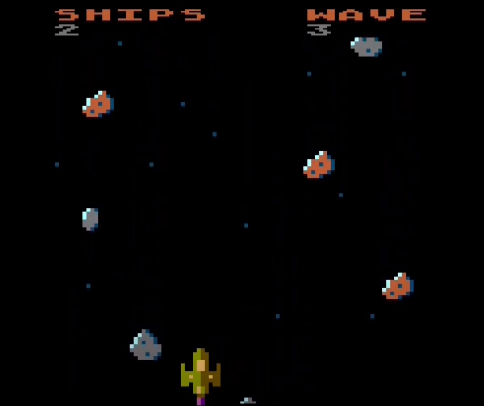
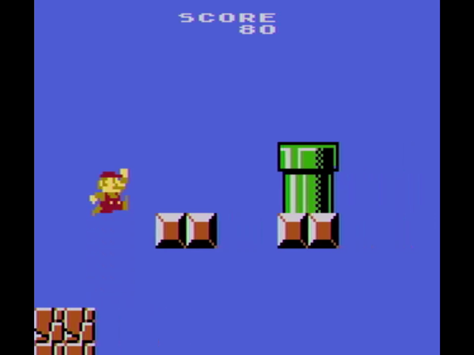

# BASIC Projects

This repo contains the source to programs I have written in various BASICs over the years

## Star Runner

A vertical space shooter/astroid dodger game, written in FastBasic for Atari 8-bit. This game demonstrates smooth scrolling, and utilizing a portion of the character set to create parallax scrolling of stars.

This was an entry for the [2023 BASIC 10 Liner Contest](https://www.homeputerium.de/) (10 lines of up to 256 characters).

It placed 2nd in both Expert rating and Public's Choice ranking.

 * Commented Source: [View Here](StarRunner/StarRunner-commented-source.bas)
 * Contest page: https://www.homeputerium.de/
 * Entry page: https://bunsen.itch.io/starrunner-by-eric-carr

## Jumpman

A randomly generated endless platform scroller inspired by Super Mario Brothers, written in FastBasic for Atari 8-bit. I chose "Jumpman" since it was the original name for Mario in Donkey Kong before the arcade game came to the US, and initially I was using Donkey Kong's music before I made space enough to include multiple SMB tunes. A fun historical note:  Donkey Kong helped inspire Randy Glover to create the very popular 1983 Jumpman game on Atari and C64.

This was an entry for the [2023 BASIC 10 Liner Contest](https://www.homeputerium.de/) (10 lines of up to 256 characters).

It placed 1st in Public's Choice and 4th in the Expert rating.

 * Commented Source: [View Here](Jumpman/Jumpman-commented-source.bas)
 * Contest page: https://www.homeputerium.de/
 * Entry page: https://bunsen.itch.io/jumpman-by-eric-carr

 ## Pacman

I challenged myself to develop a Pacman clone in FastBasic. You can play 10+ levels, the fruit changes, the ghosts get faster, and power time shrinks.  I learned a great deal about the original Pacman while doing this. There is no sound except the opening music. I did start experimenting with sound, and this file is also here. I may return to finish this game at some point and add sound using an interrupt. The ghost movement is currently random, but it does follow the same rules as the original - the ghosts cannot switch directions 180 degrees arbitrarily or move UP into the blank area below their home from below.

The number in the top left is FPS, and the top right is your score.

The source is not commented, but is presented as-is. 

 * Source: [pacman.bas](Pacman/pacman.bas)
 * Sound Attempt: [pacman-sound-attempt.bas](Pacman/pacman-sound-attempt.bas)
 

# Development Environment
* FastBasic is fast interpreter for the BASIC language on the Atari 8-bit computers and the Atari 5200 console.  You can download it at https://github.com/dmsc/fastbasic
* I use the cross platform compiler in Windows and Mac, coding in [Visual Studio Code](https://code.visualstudio.com/).
* I wrote a [FastBasic Debugger Extension](https://marketplace.visualstudio.com/items?itemName=EricCarr.fastbasic-debugger) for VSCode to aid in my coding. You can set breakpoints, step through code, and inspect/change variables via an emulator. The extension can automatically install both FastBasic and an Atari Emulator on your Mac (AtariMacX) or Windows (Altirra) machine.

# Other Tools Used
* [Atari FontMaker](https://github.com/matosimi/atari-fontmaker) - Creating custom character sets for sprite/playfield graphics
* [SprEd](https://bocianu.gitlab.io/spred) - Player/Missle Sprite editor