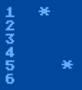

# Snow Demo (Atari BASIC)


## Background
I wrote this as part of a snow fall challenge in 2023, and made it a 10 liner to challenge myself. This demo illustrates how to create the illusion of 40 individual snowflakes falling smoothing, while snow gradually piles up on the ground, using only the BASIC that was built in to Atari XL and XE machines.

## Explanation of code
Moving 40 objects on the screen in Atari BASIC at a decent frame rate with a parallax effect? Impossible! So, how did I do it?  Custom charsets to the rescue!  Instead of constantly redrawing the snowflakes, the screen stays mostly unchanged. I start with an empty character set (every character is an empty space), then move a snowflake character through the characters, one byte (or row of pixels in a single character) at a time using Atari string commands.

The downside of this approach is that it consumes a lot of characters, so you are limited in what else you can put on the screen. However, if you can get by without using some characters, it can be added to games for a cool effect, like a moving star field.

#### Custom charset to the rescue!


Here is the Atari charset, shown in 4 rows of 32 characters each:


I split each row into its own string. The first 3 rows are used for the 3 types of snowflakes that fall. The final row is used for the accumulating snow at the bottom of the screen and the "let it snow" text on the screen.

Here is what the screen looks like when the custom charset is not enabled. Each vertical column contains characters from one of the rows, always in ascending order:


It is a bunch of static columns of ascending characters. e.g. "ABCD".

For example, consider the following characters that would normally display onscreen like this (X wraps back to A):


In order to animate two falling snowflakes, I first clear the entire character set so no letters are displayed, then copy the snowflake character (here represented as "*@*") only to the "A" character, resulting in this output:


When I move the snowflake to the "B" character (clearing A), all A characters on screen are blanked out, and the B character displays the snowflake:


#### Smooth scrolling
In order to get the snowflakes to fall pixel by pixel, I take advantage of the fact that an entire Atari charset is laid out in memory as a series of vertical rows, one character after the next. A character is represented by 8 rows, and each row is represented by a byte, so 8 bytes per character.


* (Image taken from https://www.atariarchives.org/agagd/chapter3.php - go there to learn more about Atari charsets).

So, after 8 bytes for "A", will be 8 bytes for "B", then "C", and so on.

When I shift the character in "A" down two bytes, some rows of the star are at the bottom of "A" and 2 are at the top of "B". Since I drew "B" directly below "A" onscreen, the snowflake appears to smoothly fall down. The Atari automaticaly updates the characters on the screen without needing to issue any draw commands.


Since there are 24 lines, I take 24 consequtive characters in the charset (e.g. A through X). In order to have 3 independent tracks of snowflakes (each using a different snowflake character), I use three sets of contiguous characters characters in the character set to do this.

Finally, for the growing snow at the bottom, I create 8 characters, each character a row taller than the previous. I update the screen one character per frame to show the snow accumulating, until I overwrite the entire screen:


## Explanation of code

To make this slightly less confusing, I have re-aranged the 10-liner statements in a more logical way to understand. It is the same code, split into a few more lines.

```
REM DIMENSION OUR ARRAYS
0 DIM F1$(1),F2$((INT(ADR(F1$)/1024)+1)*1024-ADR(F1$)+8),C1$(255),C2$(255),C3$(255),C4$(255),B$(1600),R(40):H=1

REM SETUP ARRAY TO HOLD RANDOM X LOCATIONS FOR SNOW ACCUMULATION
1 R(39)=39:FOR I=38 TO 0 STEP -1:R(I)=I:V=INT(RND(0)*(39-I))+I:Y=R(I):R(I)=R(V):R(V)=Y:NEXT I

REM CLEAR B$, GET SCREEN LOCATION, POINT ATARI TO CUSTOM CHARSET
2 B$=CHR$(0):B$(1600)=B$:B$(2)=B$:Z=PEEK(88)+256*PEEK(89):POKE 756,ADR(C1$)/256

REM CREATE CUSTOM CHARSET SOURCE BUFFER, TO BE COPIED TO C$ STRINGS EACH FRAME
3 W=ADR(B$)+8:FOR Y=W TO W+800 STEP 400:L=Z+880:FOR I=1 TO 8:READ C:POKE Y+I,C:POKE Y+192+I,C:NEXT I:NEXT Y

REM CLEAR CURSOR, SOURCE BUFFER INDEX LOCATIONS FOR 3 SNOWFLAKE TYPES
4 POKE 94,0:POKE 752,1:W=ADR(C4$):E=57606:A=806:B=506:C=6:D=121

REM THE SNOWFALL MAGIC HAPPENS HERE! COPY 192 BYTES FROM THE BUFFER TO THE THREE ROWS OF CHARSETS
5 C1$=B$(A,A+191):A=A-1+(A=801)*191:C2$=B$(B,B+191):B=B-2+(B=402)*190:C3$=B$(C,C+191):C=C-3+(C=3)*192

REM ON FIRST RUN, INITIALIZE. SLOWLY GROW SNOW AT BOTTOM OF SCREEN
6 ON H GOTO 7:POKE L+R(M),D:M=M+1:ON M<40 GOTO 5:M=0:D=D+1:ON D<129 GOTO 5:D=121:L=L-40:ON L>Z GOTO 5:RUN

REM INITIALIZE SCREEN BY DRAWING COLUMNS OF CONSEQUTIVE CHARS
7 H=0:M=0:FOR I=0 TO 39:POKE Z+920+I,128:V=INT(RND(0)*24)+1:T=(I-3*INT(I/3))*32:FOR Y=0 TO 880 STEP 40

REM DRAW THE NEXT CONSEQUETIVE CHARACTER, LOOPING IF IT REACHES THE END
8 POKE Y+Z+I,V+T:V=V+1:IF V>24 THEN V=1

REM LOOP FOR COLUMN DRAWING, THEN PRINT "LET IT SNOW" 3 TIMES
9 NEXT Y:NEXT I:FOR I=0 TO 2:POSITION 7+I*7,6+I*3:?"let it snow":NEXT I

REM COPY THE ALPHABET CHARS FROM ROM TO OUR NEW LOCATION FOR "LET IT SNOW"
10 FOR I=8 TO 192:POKE W+I,PEEK(E+I):NEXT I

REM CREATE THE STAIR STEPPING CHARS THAT REPRESENT A GROWING LINE OF SNOW
11 FOR Y=0 TO 6:FOR I=1 TO 8:POKE W+193+(8*Y)+I,255*(I>7-Y):NEXT I:NEXT Y:GOTO 5

REM DATA FOR OUR 3 SNOWFLAKE CHARACTERS
12 DATA 16,84,214,56,214,84,16,0, 0,16,84,56,84,16,0,0, 0,0,16,56,16,0,0,0
```

## Line by line

I will now explain each line in detail.

### Line 0
```
0 DIM F1$(1),F2$((INT(ADR(F1$)/1024)+1)*1024-ADR(F1$)+8),C1$(255),C2$(255),C3$(255),C4$(255),B$(1600),R(40):H=1
```

In order to quickly manipulate the character set in memory, I use Atari BASIC's string commands.  I map the 4 rows (32 chars each)  to `C1$` through `C4$`.

1. The first two DIM variables (`F1$ ,F2$`) are fillers, meant to ensure the start of the `C1$` is at a multiple of 1024 bytes in memory, a requirement for Atari charsets. 

2. I then dimension 4 `C$` variables. Each is 256 characters long, so they can store 32 characters * 8 bytes (256 bytes). DIMming an array of (N) in BASIC, actually creates an array of N+1, indexed at 0 to N.

3. I then dimension some space for `B$` to store the source location of each of the three stars, with plenty of space before and after, as I copy a long strip of memory from `B$` to each of the `C$` strings to move the snowflakes.

4. I then create an array `R()` to random column order (0-39),  used to build up the snow on the ground evenly.

5. I also set `H=1`, which is a simple flag variable to instruct later code to GOTO setup code.

### Line 1
```
1 R(39)=39:FOR I=38 TO 0 STEP -1:R(I)=I:V=INT(RND(0)*(39-I))+I:Y=R(I):R(I)=R(V):R(V)=Y:NEXT I
```

Here I randomize the 40 column positions (0-39) in an array so I can loop through and draw a character at this X location each frame to gradually build up the snow at the bottom. I first started with true random, but as less spaces became available it slowed down the code, so I opted for a repeated loop to fill in the snow.

### Line 2
```
2 B$=CHR$(0):B$(1600)=B$:B$(2)=B$:Z=PEEK(88)+256*PEEK(89):POKE 756,ADR(C1$)/256
```

1. I use the standard trick to clear a string in Atari BASIC: `B$=CHR$(0):B$(1600)=B$:B$(2)=B$`

2. Store the start of the onscreen memory into `Z`
3. Point the Atari to the custom charset, which is the address of `C1$` divided by 256. Now the Atari will read the first row of 32 chars from `C1$`, the second row from `C2$`, and so on.

### Line 3
```
3 W=ADR(B$)+8:FOR Y=W TO W+800 STEP 400:L=Z+880:FOR I=1 TO 8:READ C:POKE Y+I,C:POKE Y+192+I,C:NEXT I:NEXT Y
```

Here I loop three times and copy the 3 characters (3 sets of characters * 8 bytes each) from the DATA statement into the B$ string buffer. I write the character at the start and the end (+192) of each buffer. I put the character at the start and end, so it covers situations when the character is split so part of it is at the beginning and part of it is at the end (when the character rolls over from, say, X back to A).

Each frame I then copy a sliding window of 192 bytes from the buffer into each `C$` string for that set of 24 characters.

```     
* represents a row of a snowflake
           0 offset                                       192 offset    
B$ Memory: ********.......................................********...

Copies this >   |**.......................................******|
Then this  >     |*.......................................*******|
Then this  >      |.......................................********|
Then this  >       |......................................********.|
Then this  >        |.....................................********..|
```

### Line 4
```
4 POKE 94,0:POKE 752,1:W=ADR(C4$):E=57606:A=806:B=506:C=6:D=121
```

1. The first two pokes hide/disable the cursor so it does not impact the display.
2. W is assigned to the address of `C4$`, for reduction of code size.
3. E represents where the original charset is stored in memory, so the letters for "LET IT SNOW" can be copied into C4$ later (the original locations of these letters are used for the snowflake.)
4. `A,B,C` each represent the starting index in the `B$` buffer to copy into `C1$,C2$,C3$`, respectively.

### Line 5
```
5 C1$=B$(A,A+191):A=A-1+(A=801)*191:C2$=B$(B,B+191):B=B-2+(B=402)*190:C3$=B$(C,C+191):C=C-3+(C=3)*192
```
The line is the start of the endless loop. It copies the snowflake and surrounding whitespace (entire 24 characters worth - 24*32=192) from the `B$` string to each of the three `C$` strings. Taking the first string as an example:

1. `C1$=B$(A,A+191)` - this copies 192 bytes from index A in the buffer to the first row of chars. This is the statement that actually creates the animation.

2. `A=A-1+(A=801)*191` - this simply decrements the A index, and wraps it around to the start when if it passes the 24th character. It could also be written like this:
`A=A-1:IF A=801 THEN A=A+191`

3. Note that I decrement `A` by 1, `B` by 2, and `C` by 3. This causes each snowflake type to fall at a different speed. `A` the slowest, `C` the fastest (3 rows each frame). This produces the parallax effect.

### Line 6
```
6 ON H GOTO 7:POKE L+R(M),D:M=M+1:ON M<40 GOTO 5:M=0:D=D+1:ON D<129 GOTO 5:D=121:L=L-40:ON L>Z GOTO 5:RUN
```
1. This checks the H flag, and jumps to line 7 to initialize the rest of the graphics.
2. Otherwise, this code increments the growing snow on the ground by drawing one character at a time, then looping back to line 5
3. In depth, this:
    * `POKE L+R(M),D:M=M+1` - Draws current "accumulating snow character" `D` in the next random location `R(M)`, incrementing the location counter `M` .
    * `ON M<40 GOTO 5:M=0:D=D+1` - Once it fills the entire line (all 40 positions) with character `D`, it increments `D` to the next "slightly taller" character, and starts over to reandomly fill all 40 locations (reseting `M`).
    * `ON D<129 GOTO 5:D=121:L=L-40` - Once the tallest character (solid white) is drawn on the entire line `L`, it moves to the next line and repeats the entire process
    * `ON L>Z GOTO 5:RUN` - If the line reaches the top of the screen `Z`, the program starts over

    